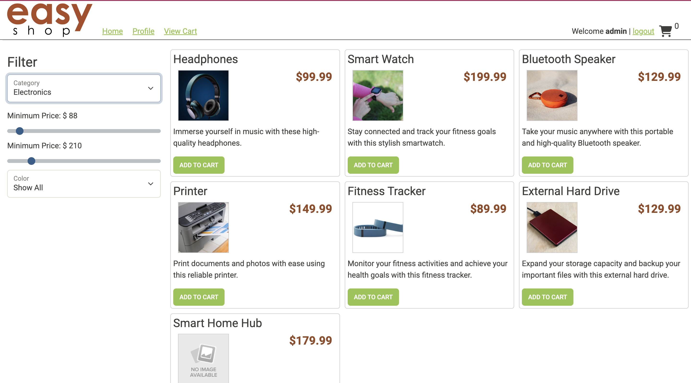

## 🛍️ EasyShop E-Commerce API – Version 2

This is the backend API for **EasyShop**, an e-commerce platform developed using **Spring Boot** and **MySQL**.
The project focuses on improving and extending an existing API (Version 1) 
by fixing bugs and adding new features such as enhanced product filtering, category management, and user profile handling.

---

## 🖥️ Main Screen




> *This is the main screen of the EasyShop website, where users can browse product categories and start shopping.*


## 🔧 Features Implemented

### ✅ Category Management

* Full CRUD for product categories
* Access restricted to `ADMIN` role
* Endpoints:

  * `GET /categories`
  * `GET /categories/{id}`
  * `POST /categories`
  * `PUT /categories/{id}`
  * `DELETE /categories/{id}`

### 🐞 Bug Fixes in Product Filtering

* Fixed incorrect search results with combinations like category + color + price
* Fixed product duplication bug during updates — updated logic to correctly **modify** instead of inserting new entries

### 👤 User Profile (Optional)

* `GET /profile` and `PUT /profile` endpoints
* Implemented `getByUserId` and `update` in `ProfileDao`

---

## 🧪 Postman Testing

Used Postman to test:

* Product filters by category, color, and price
* Profile retrieval and update
* Admin-only access to category and product modifications

---

## 🛠️ Technologies

* Java 17
* Spring Boot
* MySQL
* JDBC
* Postman
* JUnit 5
* GitHub Projects

---

## 📁 Project Structure

```
src/
├── controllers/
├── dao/
├── models/
capstone/
└── images/
    └── search-by-category-and-color-cat=2-color=red.png
```

---

## 🚀 Getting Started

1. Clone the repo:
   `git clone https://github.com/karina-krupodior/capstone-3.git` 
2. Import to IntelliJ 
3. Set up MySQL and run
4. "create_database.sql"
5. Run the Spring Boot app
6. Use Postman or the front-end to test
